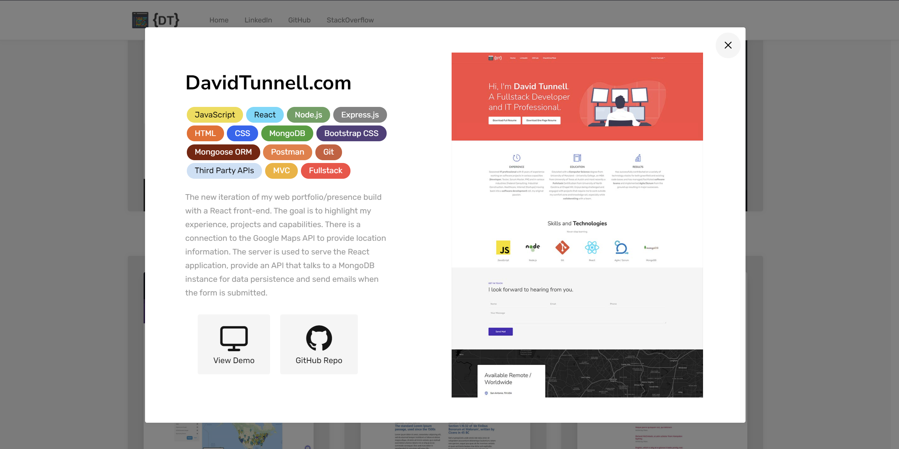

# DavidTunnell.com - A Fullstack MERN Portfolio

DavidTunnell.com is my home on the internet to showcase my experience, projects, resume, relevant links and contact information. In other words, it's my web portfolio. It is a Fullstack app with a React front-end and a Node.js/Express.js backend. The primary purpose of the server is to serve the React build directory and act as an API for the contact form, data submitted there is emailed to me and saved to a MongoDB.

The basis of the project was built on another one of my repositories. Since you can't fork your own repos, I had to clone the code to this new repo. [Microblog can be found here](https://github.com/DavidTunnell/microblog-react-router-mongodb-mongoose-node-express) for its source code and commit history. I used a premium Bootstrap theme called [GO](https://themes.getbootstrap.com/product/go-multipurpose-landing-page-template/) as a basis for styling. Open source images were obtained from [Unsplash.com](https://unsplash.com/), open source vector graphics from [Undraw.co](https://undraw.co/) and logos from [other sources](https://svgporn.com/).

[A live demo can be found here.](http://david-tunnell-dot-com.herokuapp.com/)

This project uses the following technologies/libraries.

-   [React](https://reactjs.org/) as a Fast and Powerful Frontend
-   [Google Maps API](https://developers.google.com/maps/documentation/javascript/overview) to Showcase My Location as Part of the Homepage
-   [Bootstrap 4](https://getbootstrap.com/docs/4.0/getting-started/introduction/) as a CSS Framework
-   [GO Bootstrap Template](https://themes.getbootstrap.com/product/go-multipurpose-landing-page-template/) as a Template that was Imported into React
-   [React-Google-Recaptcha](https://www.npmjs.com/package/react-google-recaptcha) in Invisible Mode to Prevent Bots from Spamming the Contact Form
-   [React-Ga](https://www.npmjs.com/package/react-ga) to Track Website Traffic data with Google Analytics
-   [Create-React-App](https://github.com/facebook/create-react-app) for Project Bootstrapping
-   [React-Router-Dom](https://www.npmjs.com/package/react-router-dom) for URL Routing, URL Parameters, Browser History Stack Usage, and Linking without Calling the Server
-   [Node.js](https://nodejs.org/en/) and [Express.js](https://expressjs.com/) as the Server for API and HTTP Requests and Serving the React Build Directory Frontend
-   [MongoDB](https://www.mongodb.com/) as a NoSQL Database
-   [Mongoose](https://mongoosejs.com/) for [Object Relational Mapping](https://en.wikipedia.org/wiki/Object%E2%80%93relational_mapping), Database Interaction, [Routing](https://expressjs.com/en/guide/routing.html) and Collection Generation and Seeding
-   [Nodemailer](https://nodemailer.com/about/) to Send Emails when the Contact Form is Submitted
-   [Nodemon](https://nodemon.io/) for more pleasant Node.js development

## Installation

This repo consists of two independent projects, a react client and a node server. The start command (`npm run build && (cd server && npm i && npm start)`) will allow them both able to be run on deployment to the same server. The dev command (`concurrently \"cd server && npm run dev\" \"react-scripts start\"`) allows both to run locally for development as well. You need to install Concurrently for this command to work. It can be installed with `npm install -g concurrently`.

After cloning the repo to your system, run `npm i` at the project root and on `./server/`to get the node project dependencies for both client and server projects and then update the files `.env.EXAMPLE` to `.env` in both projects and change any settings if necessary. The application will be available by default at `http://localhost:3000/` and API will be at `http://localhost:8000/` if you are using a local development environment. It's assumed you already have MongoDB running on your development computer.

## API Calls

Followed are the available API calls which are completely independent of the front end. If this is deployed replace `http://localhost:8000` with the correct domain information.

-   POST - http://localhost:8000/api/contact/ - save record of contact form entry

    -   Body JSON example:

    ```
        {
            "name": "David Tunnell",
            "email": "cool@email.com",
            "phone": "555-555-5555",
            "message": "This is a test.",
        }
    ```

-   POST - http://localhost:8000/api/email/ - email contact form data

    -   Body JSON example:

    ```
        {
            "name": "David Tunnell",
            "email": "cool@email.com",
            "phone": "555-555-5555",
            "message": "This is a test.",
        }
    ```

## Screenshots

### Homepage


### Project Modal


